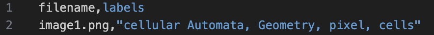
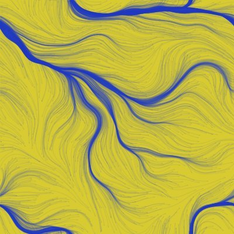
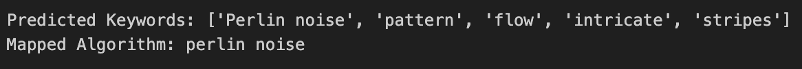
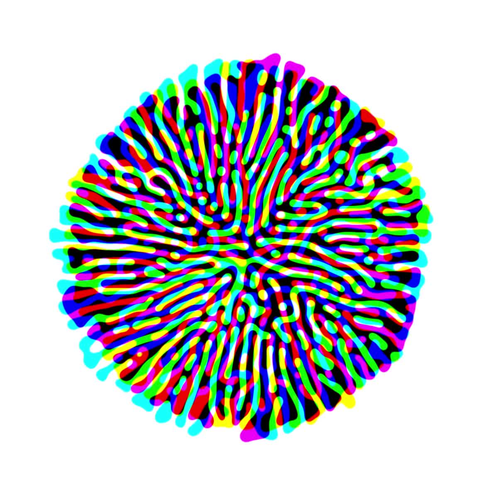
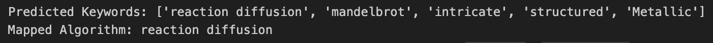
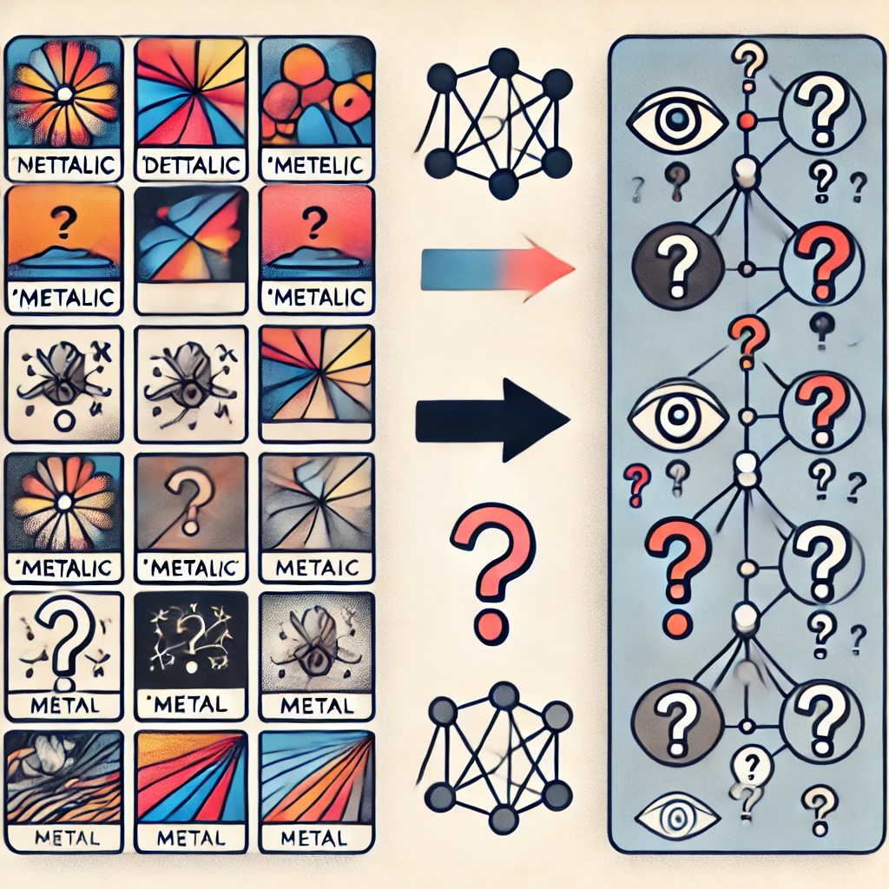
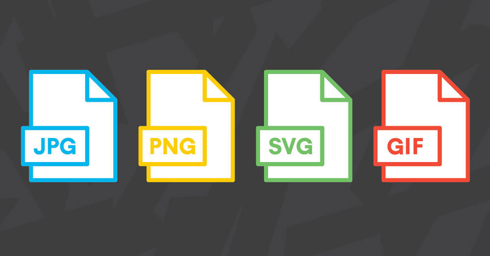
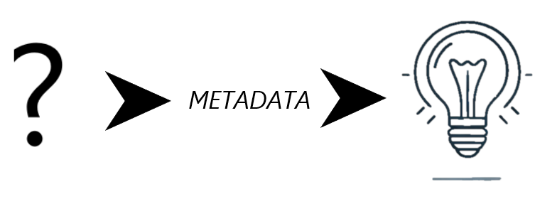
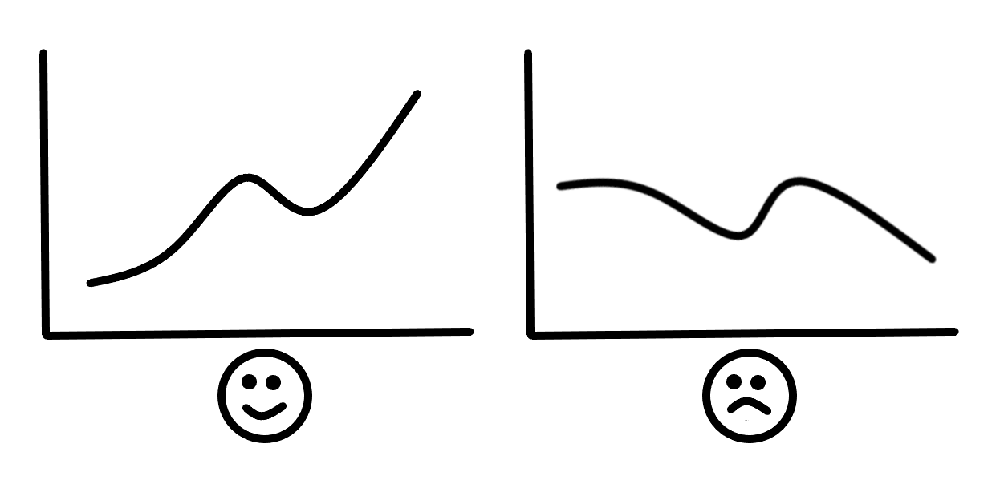

# Dataset Overview and Improvement Recommendations

## Overview
The dataset consists of images labeled with a filename and a set of descriptive tags that start with the primary algorithm used to generate the image (e.g., "Perlin noise", "cellular Automata", "reaction diffusion", etc.), followed by related descriptors that provide additional context (e.g., "swirls", "geometry", "intricate").

**Example of a dataset entry:**

## Improving the Dataset

### 1. Diversify Image Content
- **Expand Algorithm Variety:** Adding images generated from other algorithms (e.g., Julia sets, DLA, or agent-based models) would increase the dataset's diversity, allowing the model to learn a broader spectrum of visual patterns.
- **Increase Descriptive Tags:** Introduce more detailed and varied tags beyond the current set to cover subtle differences in patterns and structures. This can help the model differentiate between similar-looking images and refine its feature extraction capabilities.

    

        
**Algorithm A: Perlin Noise**

        
        
    

    

        
**Algorithm B: Reaction Diffusion**

        
        
    

### 2. Improve Label Quality
- **Standardize Tagging:** Ensure that tags are consistent and standardized across all images. Maintaining uniform spelling and avoiding overlaps or redundant tags will help reduce noise in training data.
- **Multi-label Classification:** Enhance the granularity of labeling by incorporating multi-level categories, such as visual complexity, symmetry, or color schemes. This would provide a more nuanced dataset that models can leverage to distinguish finer details.

### 3. Augment Image Formats and Qualities
- **File Format Optimization:** Choosing the optimal format based on image content can affect loading times, storage, and quality, influencing model training efficiency and output quality.

(The code already incorporates image resizing as part of the data preprocessing pipeline using the transforms.Resize((224, 224)) function in the torchvision transforms. This standardizes the image resolution to 224x224 pixels, which balances quality and training speed by using a resolution suitable for models like ResNet50. The transformations also include random horizontal flips and rotations, which help the model generalize better by slightly altering the training images each epoch.)

- **Batch Size:** Given that higher resolutions increase memory usage, monitor GPU utilization and adjust batch size accordingly to avoid running out of memory. (Current batch size : 32)

### 4. Dataset Balancing and Expansion
- **Balance Dataset Representation:** Check for over-representation or under-representation of certain algorithms or tags. Balancing the dataset ensures that the model doesn't become biased towards specific patterns or characteristics.
- **Additional Augmentations:** Adding more augmentation techniques like color jittering, scaling, or contrast adjustments, that can simulate a wider range of image conditions which should enhance model robustness.

### 5. Incorporate Metadata and Contextual Information
- **Contextual Tags:** Include tags that describe contextual or higher-level features, such as the overall theme (e.g., "biological", "mechanical") or intended emotional impact (e.g., "calm", "chaotic"). This can help the model learn to associate visual features with broader concepts.

## Outcomes of Adding Content
- **Improvements:** By enriching the dataset, models trained on it are expected to have improved generalization capabilities, higher accuracy, and better performance on tasks involving pattern recognition and classification.
- **Potential Regressions:** Introducing too much variability without careful balancing could lead to confusion and overfitting. Ensuring a systematic approach to dataset expansion is crucial to prevent these issues.

## Additional Considerations
- Regularly reviewing and updating the dataset with new images and algorithms will keep the model relevant and capable of handling the latest advancements in generative art techniques.

Implementing these strategies, will significantly improve the dataset's utility for training AI models, leading to more accurate outputs.
